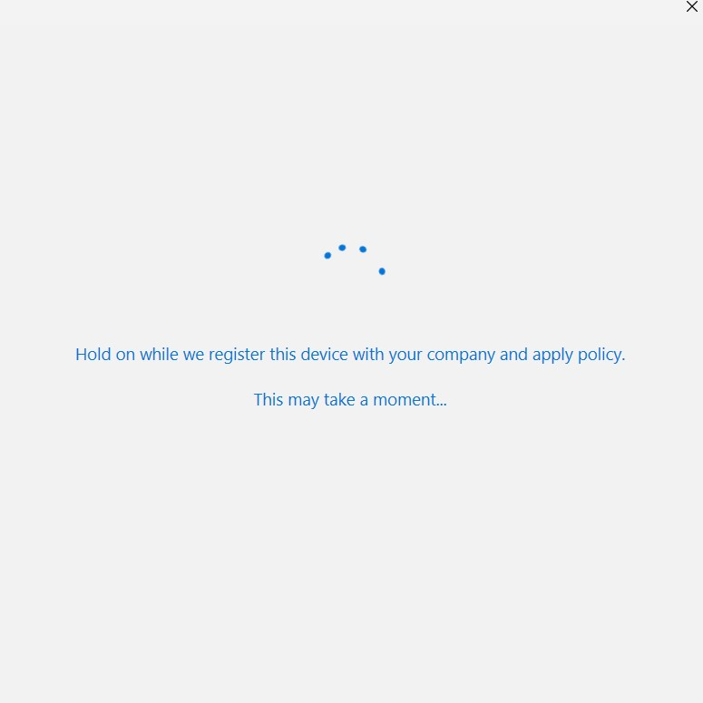

# PSMSALNet Module

:warning: This is a **Powershel 7.2** module minimum but should work on Linux/MAC/Windows.

This project wraps [MSAL.NET](https://github.com/AzureAD/microsoft-authentication-library-for-dotnet) functionality into PowerShell-friendly cmdlets. The goal is not to implement every flows MSAL can propose but the more useful and secured ones. Flow like ROPC or windows integrated flow won't be implemented for security reasons.

Why not using MSAL.PS module instead? MSAL.PS has not been updated since several months now and recently the module has been declared as an "archive" by Microsoft. On the other side, the MSAL.NET team did a wonderful job and has realeased a lot of neat features that won't be implemented in MSAL.PS.

Over the years, I've created a lot of identity scripts you can find in this Github account to interact with managed identities, Azure ARC for server or federated credentials. Rencently I've decided to create this module (mainly for my needs) because all those flows are now included in MSAL.NET which will simplify a lot of things :smiley:.

Thanks to MSAL.NET, I've discovered WAM (Web Account Manager) wich is a Windows feature compatible with modern authentication and more specificaly with MFA (compared to Windows Integrated flow)! The problem that I've discovered is that Powershell is not compatible with the library regarding WAM (at least I've stop after 20 hours of tries) this is why I've decided to try in C# directly. The funny thing is that I'm a newbie in C#.

Talking about libraries, this module rely a lot on various MSAL libraries:
- Microsoft.Identity.Client -> Core
- Microsoft.IdentityModel.Abstractions -> Core dependency
- Microsoft.Identity.Client.Broker > required for WAM
- Microsoft.Identity.Client.NativeInterop > required for WAM
- Microsoft.Identity.Client.Extensions.Msal > to serialize tokens on the local disks (in future version)

In addition, I created two other libraries for device code and WAM:
- [DeviceCodeHelper](https://github.com/SCOMnewbie/DeviceCodeHelper) -> Used for device code flow (no really?)
- [WAMHelper](https://github.com/SCOMnewbie/WAMHelper)

This module won't focus exclusively on the MSAL library but will add features around identity concepts in general to help us to better consume Entra features.

This module will feat perfectly with the [ValidateAADJWt](https://www.powershellgallery.com/packages/ValidateAADJwt) (maybe I should change the module name lol) to validate all tokens you will generate with this module.

## What you can do with this module?

### Generate Entra tokens with various flows (Get-EntraToken)

- Client credential flow with both secret and certificate for machine to machine communication (application context).
- Public Authorization Code with PKCE (human context).
- Device Code flow for headless Operating system. It's preferable to use the authorization code with PKCE instead (human context).
- Windows Account Manager flow (human context).
- On behalf flow (OBO) with both secret and certificate for your backend api (human context).
- System Managed identity from anywhere even Azure ARC for server (application context)!
- User Managed identity (application context).
- Federated credential

To help you in this complex subject, this module will re-use ideas that I've implemented in other scripts. Several resources are pre-defined (Graph API, KeyVault, Storage, ARM...) to help you to find the proper resource. In addition, for user context only (application context is auto completed) you will have to define all the permissions you need. Check examples to better understand.

### Generate X509 certificate objects (ConvertTo-X509Certificate2, Get-KVCertificateWithPrivateKey, Get-KVCertificateWithPublicKey)

Using certificate in both Windows and Linux can become a pain quickly. This module will help you to exposed X509 certificate objects you will then consume with Get-EntraToken cmdlet. This function will propose several certifacte format/source:

- **Certificate Type**:
  - Pfx
  - Pem
  - Crt
  - Cer
- **Source**:
  - Local disk
  - Azure Keyvault (JWT token required)

## What will come next?

- Improve unit testing
- Improve documentation
- Implement local token serialization for public appilcations (flows that don't need secret/cert/assertion)

## How to use it

### Client credential flow

#### With secret

This command will generate a token and sotre it in memory (linked to the Pwsh process). MSAL will manage the expiration of the token and call Entra when it will be necessary.

```Powershell
$HashArguments = @{
  ClientId = "47077650-52a9-4bc2-b689-b50002b764ee"
  ClientSecret = $ClientSecret
  TenantId = $TenantId
  Resource = 'GraphAPI'
}
Get-EntraToken -ClientCredentialFlowWithSecret @HashArguments
```

If you want to force refresh, use instead:

```Powershell
$HashArguments = @{
  ClientId = "47077650-52a9-4bc2-b689-b50002b764ee"
  ClientSecret = $ClientSecret
  TenantId = $TenantId
  Resource = 'ARM'
  WithoutCaching = $true
}
Get-EntraToken -ClientCredentialFlowWithSecret @HashArguments
```

In this case, MSAL will generate a new token to access the Azure Resource Manager resource everytime.

#### With certificate

From a windows, we can do:

```Powershell
#https://learn.microsoft.com/en-us/azure/active-directory/develop/howto-create-self-signed-certificate
$certname = "newcert"
$cert = New-SelfSignedCertificate -Subject "CN=$certname" -CertStoreLocation "Cert:\CurrentUser\My" -KeyExportPolicy Exportable -KeySpec Signature -KeyLength 2048 -KeyAlgorithm RSA -HashAlgorithm SHA256
$mypwd = ConvertTo-SecureString -String "{myPassword}" -Force -AsPlainText
# This is what you keep
Export-PfxCertificate -Cert $cert -FilePath "C:\TEMP\$certname.pfx" -Password $mypwd
# This is what you will upload to Azure app registration
Export-Certificate -Cert $cert -FilePath "C:\TEMP\$certname.cer"
# Generate the X509 object
$X509 = ConvertTo-X509Certificate2 -PfxPath C:\TEMP\newcert.pfx -Password $(ConvertTo-SecureString -String '{myPassword}' -AsPlainText -Force) -Verbose

$HashArguments = @{
  ClientId = "47048650-52a9-4bc2-b689-b50002a764ee"
  ClientCertificate = $X509
  TenantId = $TenantId
  Resource = 'Keyvault'
  verbose = $true
}

Get-EntraToken -ClientCredentialFlowWithCertificate @HashArguments
```
This will generate a token but this time with a certificate instead of a secret. This is a more secure solution, you know you won't see certificate information in proxy/firewall/logs.
Always try to use certificate compared to secrets.

### Authorization code with PKCE

Imagine you want to access a resource protected by Entra and only selected person can access the resource. Because this is a public flow (in this case), no secret will be required because the user context itself is the "secret".

```Powershell

$HashArguments = @{
  ClientId = "4adbb0ff-3cde-4fc1-b22e-94ee7d16d70b"
  TenantId = $TenantId
  RedirectUri = 'http://localhost'
  Resource = 'GraphAPI'
  Permissions = @('user.read','group.read.all')
  ExtraScopesToConsent = @('https://management.azure.com/user_impersonation')
  verbose = $true
}

Get-EntraToken -PublicAuthorizationCodeFlow @HashArguments
```

Thanks to the ExtraScopesToConsent parameter, if you now type:

```Powershell

$HashArguments = @{
  ClientId = "4adbb0ff-3cde-4fc1-b22e-94ee7d16d70b"
  TenantId = $TenantId
  RedirectUri = 'http://localhost'
  Resource = 'ARM'
  Permissions = @('user_impersonation')
  verbose = $true
}

Get-EntraToken -PublicAuthorizationCodeFlow @HashArguments
```

You will hit the MSAL cache and won't have another windows for sign-in. To summarize, the first cmdlet requests a token to access Graph API with specific permissions and requests in parallel a token to access the Azure Resource Manager resource to avoid a second popup.

### Device code

Imagine now you're on WSL/Linux (headless Operating System) but you want to access a protected resource. This is where device code can be interesting.

:warning: This flow can be considered as less secure than the other flows. Don't forget to enabled the device code flow in your app registration and this flow won't be compatible with device compliant state.

```Powershell
Get-EntraToken -DeviceCodeFlow -ClientId $ClientId -TenantId $TenantId -Resource GraphAPI -Permissions @('user.read')
```

This command will use the default redirect uri which is 'http://localhost'.

### Web Account Manager (WAM)

WAM flow connects you device you're using with an Entra tenant. Here for exemple, I'm asking a new token to access a custom API protected by Entra:

:notes: WAM seems to be the more secure way because this flow is compatible with the [token protection](https://learn.microsoft.com/en-us/azure/active-directory/conditional-access/concept-token-protection) conditional access. In addition, if your machine is already Azure joined, you won't even have to enroll it and you will be able to generate tokens straight away.

```Powershell
Get-EntraToken -WAMFlow -ClientId $clientId -TenantId $tenantId -RedirectUri 'ms-appx-web://Microsoft.AAD.BrokerPlugin/9f0...8f01' -Resource Custom -CustomResource api://AADToken-WebAPI-back-OBO -Permissions access_asuser
```

Once you execute the command, you should see:


Once you hit OK, the device enrollment should start:



And after few seconds, you should see:


Now if you go on your tenant, you should see a new device linked to your account and in parallel, you should receive your access/id tokens.

If you re-execute the command, you will hit the MSAL cache.

### On Behalf flow (OBO)

This flow is used when from a backend API (or a web site) you want to re-use the user context to access another API. Here the Microsoft diagram regarding this flow:


To make it works, you first have to generate a token to access a custom protected exposed API and then, from this backend API, you will be able to call another API but with the user context. Let's generate a token from a client using one of the previous public flows (authorization code, device code, WAM).

```Powershell
$HashArguments = @{
  ClientId = "0a74a6ca-489b-4e81-acdb-bd91db65b239" #Frontend client
  TenantId = $TenantId
  Resource = 'Custom'
  CustomResource = 'api://5449c592-36c4-47ca-8b02-d9813f4bf2d1'
  Permissions = 'access_as_user'
  verbose = $true
}

$FrontEndClientToken = Get-EntraToken -PublicAuthorizationCodeFlow @HashArguments
```

#### With secret

Let's now imagine we're on the backed API this time and we will receive the access token previously generated. The backend API has Graph API permission to read user information. As you can see the previous custom resource become the client this time:

:notes: Don't forget to admin consent the backend api permission even for non admin permissions.

```Powershell

Get-EntraToken -OnBehalfFlowWithSecret -ClientId $BackendClientId -ClientSecret '20n...B' -TenantId $tenantId -Resource GraphAPI -Permissions 'User.read' -UserAssertion $FrontEndClientToken.accesstoken | % AccessToken
```

If you now copy this new token in JWT.ms, you will see this is a Graph API token under the user context:


:warning: This is where the module [ValidateAADJWt](https://www.powershellgallery.com/packages/ValidateAADJwt) starts to shine. Your backend API must validate the token you receive.

You can find more information on this flow [here](https://learn.microsoft.com/fr-fr/azure/active-directory/develop/v2-oauth2-on-behalf-of-flow).

#### With certificate

If we re-use the previous generated certificate:

```Powershell
$X509 = ConvertTo-X509Certificate2 -PfxPath C:\TEMP\newcert.pfx -Password $(ConvertTo-SecureString -String '{myPassword}' -AsPlainText -Force) -Verbose
Get-EntraToken -OnBehalfFlowWithCertificate -ClientCertificate $X509 -UserAssertion $FrontEndClientToken.accesstoken -ClientId $BackendClientId -TenantId $tenantId -Resource GraphAPI -Permissions 'User.read' | % AccessToken
```

Like with the secret flow, you will receive the same token.

### System Managed Identity

#### From a Windows Azure VM (tested)

On a fresh new Azure VM, install Powershell 7 and then type:

```Powershell
install-module PSMSALNet
Get-EntraToken -SystemManagedIdentity -Resource GraphAPI
```

#### From a Linux Azure VM (tested)

Once Powershell 7 installed, run:

```Powershell
install-module PSMSALNet
Get-EntraToken -SystemManagedIdentity -Resource GraphAPI
```

#### From a Windows Azure function (tested)

Once the PSMSALNet module added to your requirements.psd1, run:

```Powershell
Get-EntraToken -SystemManagedIdentity -Resource GraphAPI
```

#### From a Linux Azure function (tested)

Once the PSMSALNet module added to your requirements.psd1, run:

```Powershell
Get-EntraToken -SystemManagedIdentity -Resource GraphAPI
```

#### From Azure Container Instance (tested)

Once the container built with the Dockerfile (check the deploy.ps1 script) in the examples folder, deploy a new ACI and enable the system MSI. And again, same command to get your access token.


#### From Windows ARC for server (tested)

Once you've installed Powershell7, PSMSALNet module and installed (enrolled) the ARC agent, you run the same cmdlet again and you should receive a new token

```Powershell
Get-EntraToken -SystemManagedIdentity -Resource GraphAPI
```

#### From Linux ARC for server (tested)

:warning: Does not work for now, for now use this [script](https://github.com/SCOMnewbie/Azure/blob/master/Identity-AAD/Get-AccessTokenWithAzIdentity.ps1) instead.

Error received:


Bug declared in [MSAL.net github repository](https://github.com/AzureAD/microsoft-authentication-library-for-dotnet/issues/4358).

### Federated credentials

#### From a managed or non managed **Kubernetes cluster**

You can find the documentation under the Examples\aks-workloadidentity folder.

The highlights are:

- Create the app registration that will represent your pod(s)
- Create the Kube cluster like AKS
- Install the workload identity part with Helm
- Create and ACR and make it build you container, then connect your Kube cluster to your ACR
- Deploy your Pod, check the pod logs and you should see your container can now request for it's own tokens.

App registration configuration:


```Powershell
$KubeSaToken = Get-Content -Path '/var/run/secrets/azure/tokens/azure-identity-token'
Get-EntraToken -FederatedCredentialFlowWithAssertion -UserAssertion $KubeSaToken -ClientId $([Environment]::GetEnvironmentVariable('AZURE_CLIENT_ID')) -TenantId $([Environment]::GetEnvironmentVariable('AZURE_TENANT_ID')) -Resource GraphAPI
```

## How to contribute

This module is based on Sampler module. To contribute, clone the repo and run a .\build.ps1 -Task build -ResolveDependency
